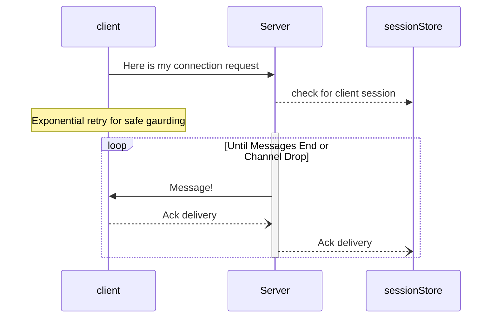

# Overview

The problem is to implement a client and server that implement the following functionality.

A client connects to the server to receive a stream of numbers. Upon receiving a connection, the server streams a sequence of random numbers in a random number of discrete messages, each 1s apart, until all the messages are sent and the connection is then closed.

The client's job is to connect and receive the complete sequence of numbers, close the connection, and return the sum of the received numbers. 

The client must be capable of reconnecting and continuing to receive the sequence in the case that its connection drops. In implementing this, the client is allowed to assume that the sequence is deterministic; ie given any number in the sequence, the subsequent numbers will always be the same.

Note : 

1. GRPC Noise [Known Issue](https://github.com/grpc/grpc-dotnet/issues/767)
2. Adler-32 [used for rolling checksum](https://en.wikipedia.org/wiki/Adler-32)

## Diagram


Default Service port is 5500

## How to Build & Run 

prerequisites :

[.Net6 sdk](https://dotnet.microsoft.com/en-us/download/dotnet/6.0)

1. Build and Run As Binaries 

```cmd
    dotnet build 
    dotnet run --project .\MessagingServer\MessagingServer.csproj 5500
    dotnet run --project .\MessagingClient\MessagingClient.csproj 5500 10 [guid/clientId]
```

2. Test
   
```cmd
    dotnet test 
```

other test scenarios are manual at this time as it include process kill or session closing behaviors

## Behaviors
1. you can kill a client and it will resume from where is left and finally close with a checksum verification
2. you can kill server and client will **retry with exponential backoff** 
   1. Since we have only in memory store - server will loose state as of now